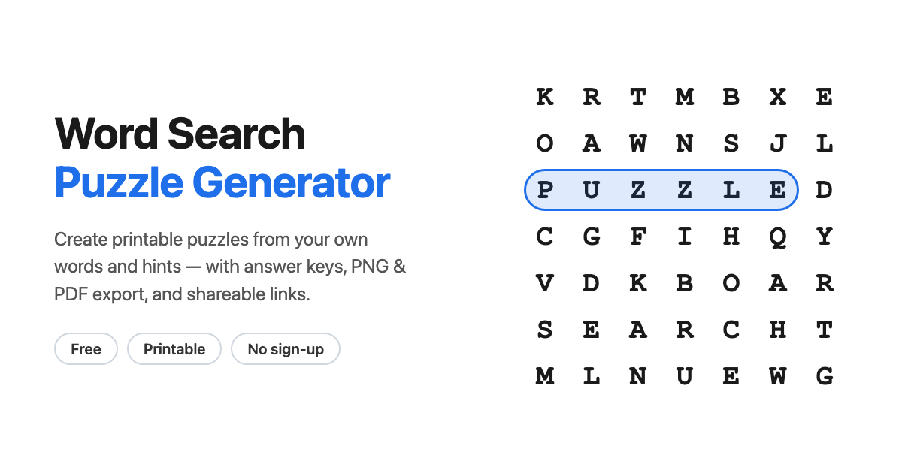

# Word Search Puzzle Generator

[](https://cheeleong.dev/word_search_puzzle/)
[](LICENSE)
[](#run-locally)

A free, browser-based generator for creating printable word search puzzles from your own words and hints. Build a puzzle, reveal its answer key, download it as a PNG, save a two-page PDF, or share the exact puzzle with a link.

[Open the live app](https://cheeleong.dev/word_search_puzzle/) · [Read the specification](docs/SPEC.md)



## Features

- Generate a dynamically sized puzzle from custom words and clues.
- Place words horizontally, vertically, diagonally, and in reverse.
- Recreate the same puzzle with a numeric or text seed.
- Prevent duplicate answers and accidental extra occurrences in filler letters.
- Switch between numbered hints and colored answer highlights.
- Tune grid padding, hint size, placement attempts, and puzzle retries.
- See placement count, grid dimensions, and word-cell coverage at a glance.
- Download the current puzzle or answer key as a PNG.
- Open a print-ready, two-page puzzle and answer key for saving as PDF.
- Copy a link containing the words, settings, and seed for an identical shared puzzle.
- Save settings locally in the browser, with a control to clear them.
- Use a responsive interface with a screen-reader-friendly grid fallback.

Everything runs locally in the browser. There are no accounts, dependencies, analytics, or server-side processing.

## Use the generator

1. Enter a title and one word-and-hint pair per line.
2. Choose the allowed directions and any display options.
3. Select **Generate New Puzzle**.
4. Use **Hide Answers** to produce the student copy.
5. Download a PNG, export through the browser's PDF dialog, or copy a share link.

### Input format

The classic format starts each line with an uppercase puzzle word:

```text
OCEAN A large body of salt water
CORAL A marine invertebrate that builds reefs
```

Use an em dash, en dash, or spaced hyphen for lowercase or multi-word entries:

```text
ice cream — a frozen dessert
sea turtle - a marine reptile with a shell
```

Spaces are removed when a multi-word answer is placed in the grid, while the readable form remains in the hints. Blank lines and invalid entries are ignored; duplicate answers are skipped with a notice.

## Run locally

No installation or build step is required. Clone the repository and open `index.html` in a modern browser:

```bash
git clone https://github.com/klrkdekira/word_search_puzzle.git
cd word_search_puzzle
open index.html
```

Alternatively, serve the folder from any static web server:

```bash
python3 -m http.server 8000
```

Then visit `http://localhost:8000`.

## Project structure

```text
.
├── index.html          # App markup, metadata, and structured data
├── styles.css          # Screen, responsive, and print styles
├── app.js              # Generation, rendering, sharing, and persistence
├── assets/             # Favicon, touch icon, and social preview
├── docs/
│   ├── SPEC.md         # Functional and implementation specification
│   └── TODO.md         # Completed work and improvement history
├── sitemap.xml         # Search-engine sitemap
└── LICENSE             # MIT license
```

## How generation works

The generator sizes the grid from the longest answer and the selected padding, then attempts each word in the enabled directions. Placements favor letter intersections while also spreading words across the board. A seeded pseudo-random number generator makes the result reproducible, and a final scan re-rolls filler letters that accidentally create another answer.

For implementation details and defaults, see [docs/SPEC.md](docs/SPEC.md).

## Privacy

Puzzle content and settings stay in your browser. Saved preferences use `localStorage`, and shared puzzle data is encoded in the URL fragment rather than sent to a backend.

## License

Released under the [MIT License](LICENSE).
